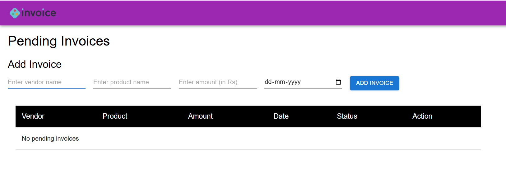
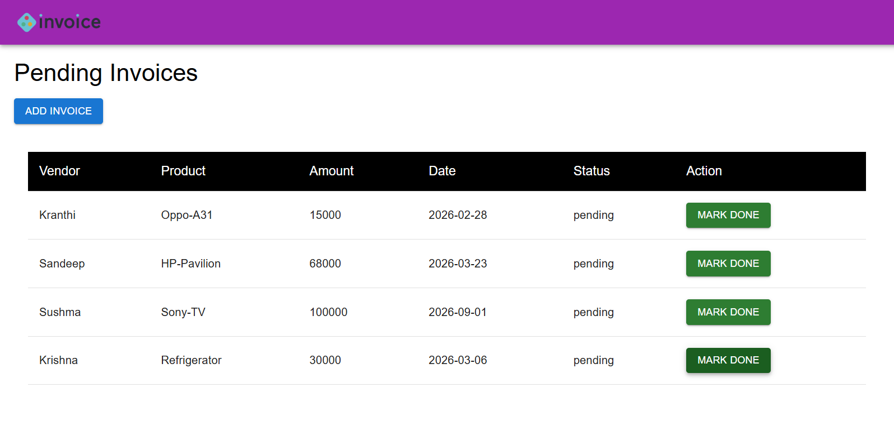
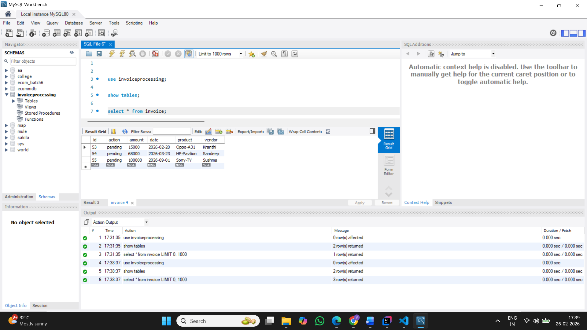

# Invoice Management System

A simple **full-stack web application** to create, view, and manage invoices digitally.
It replaces paper-based records by allowing users to add invoices with vendor, product, amount, and due date details. 

This project helped me learn end-to-end development: building a React frontend, Spring Boot backend APIs, and MySQL database integration.

## Tech Stack
- **Frontend**: React.js (with basic HTML, CSS for UI)
- **Backend**: Java + Spring Boot (REST APIs, Hibernate for database access)
- **Database**: MySQL
- **Tools**: Git, Visual Studio Code, IntelliJ IDEA, MySQL Workbench

## Features
- Add new invoices with vendor name, product name, amount (in Rs), and due date.
- View list of pending invoices in a table format.
- Mark an invoice as "done" (paid) using a button — updates status in real-time.
- Data persists in MySQL database.
- Basic CRUD operations on the backend.

## Screenshots

### 1. Empty State (No Pending Invoices)


Shows the clean UI when there are no invoices: add form at the top and empty table message.

### 2. Pending Invoices List with Data


After adding multiple invoices:
- Table displays Vendor, Product, Amount, Date, Status (pending), and MARK DONE button.
- Clicking "MARK DONE" updates the status (backend PUT request).

### 3. MySQL Database View


Backend confirmation: Invoices are stored in the `invoice` table with columns like id, vendor, product, amount, date, action (status as 'pending').

### Prerequisites
- Java 17+ (for Spring Boot)
- Node.js 16+ and npm (for React)
- MySQL 8+ installed and running
- Git
  
### Clone the Repository
```bash
git clone https://github.com/Kranthiram/Invoice_management_system.git
cd Invoice_management_system
